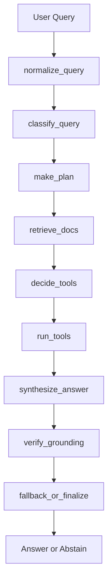

# Agentic Research Workflow Learning Environment

`agentic-research-workflow` is a compact educational project for studying how a baseline RAG system evolves into a stateful agentic workflow. The repository is designed to be runnable, inspectable, and easy to explain in an interview, but it now also acts as a step-by-step notebook course.

## Project Overview

The learning environment demonstrates:

- baseline RAG
- query classification
- planning
- retrieval
- agent memory systems
- local tool calling
- answer synthesis
- grounding verification
- abstention and fallback
- execution trace logging
- repeated evaluation
- failure analysis

The core logic lives in `src/`. The notebooks import that logic and explain it in tutorial form instead of duplicating it.

## Agent Architecture



The workflow stays deterministic on purpose. That makes every step easier to study, trace, test, and discuss.

## Notebook Guide

The notebooks are meant to be read and run in order:

1. `notebooks/01_rag_basics.ipynb`
   Learn what RAG is, how chunking works, how the local vector index retrieves evidence, and where naive RAG falls short.
2. `notebooks/02_agentic_workflow.ipynb`
   Walk through `AgentState` and the workflow nodes one by one, then inspect the execution trace.
3. `notebooks/03_evaluation.ipynb`
   Load the evaluation dataset, run repeated comparisons, and interpret the metrics.
4. `notebooks/04_failure_analysis.ipynb`
   Extract failure cases, inspect traces, and turn failure modes into improvement ideas.
5. `notebooks/05_agent_memory.ipynb`
   Study short-term, long-term, vector, and episodic-style memory patterns, then connect memory retrieval to the agent workflow.

Every code cell has a Markdown explanation directly above it, and every notebook starts with `sys.executable` so you can verify the active environment.

## Repository Layout

```text
agentic-research-workflow/
├─ pyproject.toml
├─ uv.lock
├─ Makefile
├─ README.md
├─ requirements.txt
├─ .env.example
├─ AGENTS.md
├─ scripts/
│  ├─ setup_uv_env.sh
│  └─ run_jupyter.sh
├─ data/
│  ├─ raw/
│  ├─ processed/
│  └─ eval/
├─ notebooks/
│  ├─ 01_rag_basics.ipynb
│  ├─ 02_agentic_workflow.ipynb
│  ├─ 03_evaluation.ipynb
│  ├─ 04_failure_analysis.ipynb
│  └─ 05_agent_memory.ipynb
├─ src/
├─ artifacts/
│  ├─ traces/
│  ├─ logs/
│  └─ reports/
└─ tests/
```

## Sample Data

The corpus intentionally mixes small, readable document types so the retrieval behavior is easy to follow:

- policy documents
- rollout and governance notes
- product overview notes
- technical retrieval notes

The evaluation dataset lives in `data/eval/eval_dataset.json` and contains 16 questions spanning lookups, comparisons, summaries, multi-hop reasoning, and insufficient-evidence cases.

## Core Modules

- `src/ingestion.py`: load documents, split them into chunks, and optionally persist processed artifacts
- `src/retriever.py`: local TF-IDF plus lexical-overlap retrieval
- `src/classifier.py`: query classification and tool-need heuristics
- `src/planner.py`: query-type-specific plan templates
- `src/tools.py`: calculator, date parser, and keyword extractor
- `src/memory.py`: short-term, long-term, and vector memory utilities plus memory visualization helpers
- `src/synthesizer.py`: grounded draft-answer construction
- `src/verifier.py`: evidence coverage and unsupported-claim checks
- `src/fallback.py`: abstain-versus-finalize decision policy
- `src/workflow.py`: baseline RAG, public workflow nodes, and the end-to-end agent run
- `src/evaluator.py`: repeated evaluation, summaries, failure extraction, and persisted reports
- `src/utils.py`: text helpers, JSON helpers, and trace visualization

## How To Run Locally

Install `uv`, create the environment, register the notebook kernel, then launch Jupyter:

```bash
curl -LsSf https://astral.sh/uv/install.sh | sh
./scripts/setup_uv_env.sh
./scripts/run_jupyter.sh
```

You can also use the Make targets:

```bash
make setup
make jupyter
make eval
```

## Running On DGX Spark

The repository supports a simple split workflow:

- local machine: Codex edits code, commits, and pushes
- DGX Spark server: pulls the repo, syncs the uv environment, launches Jupyter Lab, and runs notebooks

Example DGX flow:

```bash
git clone <repo>
cd agentic-research-workflow
curl -LsSf https://astral.sh/uv/install.sh | sh
./scripts/setup_uv_env.sh
./scripts/run_jupyter.sh
```

Create an SSH tunnel from your local machine:

```bash
ssh -L 8888:localhost:8888 dgx-host
```

Then open [http://localhost:8888](http://localhost:8888).

## Optional DGX GPU Support

The project works on CPU-only machines. If you want to validate CUDA visibility on DGX, install GPU PyTorch inside the uv environment:

```bash
uv add torch torchvision --index https://download.pytorch.org/whl/cu121
```

Validation command:

```bash
uv run python -c "import torch; print(torch.cuda.is_available())"
```

Expected result on DGX: `True`

## Development Flow

Local machine:

- Codex modifies code
- commit
- push

DGX machine:

- `git pull`
- `uv sync --locked`
- `./scripts/run_jupyter.sh`

## Evaluation Explanation

The evaluation notebook and CLI compare baseline RAG with the agent workflow using:

- answer correctness
- retrieval hit rate
- grounding pass rate
- abstain precision
- latency
- average reasoning steps

Persisted outputs:

- `data/eval/eval_results.json`
- `artifacts/reports/evaluation_summary.json`
- `artifacts/traces/*.json`

CLI entrypoint:

```bash
uv run python src/evaluator.py --persist-outputs
```

## Failure Analysis Explanation

The failure analysis notebook groups weak runs into simple categories such as:

- `retrieval_miss`
- `query_misclassification`
- `bad_plan`
- `synthesis_quality_gap`
- `ungrounded_synthesis`
- `insufficient_evidence_not_detected`
- `over_abstention`

The point is not to claim perfect diagnosis. The point is to create a repeatable debugging workflow that connects architecture decisions to observed errors.

## Agent Memory Explanation

`05_agent_memory.ipynb` introduces memory as a separate learning unit. It covers:

- short-term buffers for recent turns
- JSON-backed long-term memory
- vector memory for similarity search
- memory retrieval alongside document retrieval
- selective update strategies and summarization
- optional workflow integration through `run_workflow_with_memory(...)`

The notebook is designed for experimentation, so learners can store memories, reload them, inspect search rankings, and see memory nodes appear in the workflow trace.

## Why TF-IDF Instead of Remote Embeddings

The original design calls for embeddings and vector retrieval. This repository implements that idea with a local TF-IDF vectorizer because it is:

- offline and reproducible
- fast enough for notebooks and tests
- easy to run on laptops and DGX machines alike
- straightforward to explain in interviews

## Verification Commands

```bash
uv run pytest -q tests
uv run python src/evaluator.py --persist-outputs
```

To execute the notebooks from the command line:

```bash
for nb in notebooks/*.ipynb; do
  uv run jupyter nbconvert --to notebook --execute \"$nb\" --output-dir /tmp/agentic-notebooks >/dev/null
done
```

## Future Improvements

- add optional dense embedding backends
- expand the evaluation set with harder multi-hop questions
- add threshold-sweep experiments for the verifier
- compare multiple retrieval settings in the notebooks
- add notebook exercises for modifying planner templates
