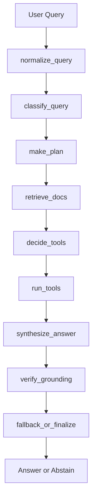

# Agentic Research Workflow Learning Environment

`agentic-research-workflow` is a compact educational project for studying how a baseline RAG system evolves into a stateful agentic workflow. The repository is designed to be runnable, inspectable, and easy to explain in an interview, but it now also acts as a step-by-step notebook course.

## Project Overview

The learning environment demonstrates:

- baseline RAG
- query classification
- planning
- retrieval
- agent memory systems
- local tool calling
- answer synthesis
- grounding verification
- abstention and fallback
- execution trace logging
- repeated evaluation
- failure analysis

The core logic lives in `src/`. The notebooks import that logic and explain it in tutorial form instead of duplicating it.

## Architecture



The workflow stays deterministic on purpose. That makes every step easier to study, trace, test, and discuss.

Node roles:

| Node | Role |
|------|------|
| `normalize_query` | Clean and normalize the raw user request before downstream logic. |
| `classify_query` | Map the query to one of the supported workflow types and decide whether tools are likely needed. |
| `make_plan` | Build an explicit ordered plan template the learner can inspect. |
| `retrieve_docs` | Pull the most relevant chunks from the local corpus. |
| `decide_tools` | Choose local-only tool requests when arithmetic, date logic, or keyword extraction would help. |
| `run_tools` | Execute local tools and attach structured outputs to state. |
| `synthesize_answer` | Draft an answer grounded in retrieved evidence and tool results. |
| `verify_grounding` | Check coverage and unsupported claims before finalization. |
| `fallback_or_finalize` | Finalize a cautious answer or abstain when evidence is weak. |

The memory workflow adds `retrieve_memories` after document retrieval and `update_memory` at the end so learners can inspect how memory-augmented runs differ from stateless runs.

For the full set of workflow, memory, and state lifecycle diagrams, see [docs/architecture.md](docs/architecture.md).

## Notebook Guide

The notebooks are meant to be read and run in order:

1. `notebooks/01_rag_basics.ipynb`
   Learn what RAG is, how chunking works, how the local retriever surfaces evidence, and where naive RAG falls short.
2. `notebooks/02_agentic_workflow.ipynb`
   Walk through `AgentState` and the workflow nodes one by one, then inspect the execution trace.
3. `notebooks/03_evaluation.ipynb`
   Load the evaluation dataset, run repeated comparisons, and interpret the metrics.
4. `notebooks/04_failure_analysis.ipynb`
   Extract failure cases, inspect traces, and turn failure modes into improvement ideas.
5. `notebooks/05_agent_memory.ipynb`
   Study short-term, long-term, and vector memory patterns, then connect memory retrieval to the agent workflow.
6. `notebooks/06_agent_planning.ipynb`
   Compare planner styles such as ReAct-inspired decomposition and planner-executor execution.
7. `notebooks/07_tool_use.ipynb`
   Learn how structured tool calls flow through a local tool registry and deterministic tools.
8. `notebooks/08_agent_debugging.ipynb`
   Inspect traces, node-level inputs and outputs, and per-node latency during debugging.
9. `notebooks/09_llm_integration.ipynb`
   Add Ollama-based LLM synthesis and verification on top of the deterministic workflow, including fallback behavior.
10. `notebooks/10_model_comparison.ipynb`
    Compare model sizes and the rule-based path across answer quality, latency, and GPU memory usage.
11. `notebooks/11_real_data_tech_docs.ipynb`
    Move from the demo corpus to real public technical documentation and observe how failure modes change.
12. `notebooks/12_real_data_korean.ipynb`
    Run multilingual retrieval and answer generation on Korean public data, then inspect language-specific limits.
13. `notebooks/13_finetuning.ipynb`
    Study a QLoRA fine-tuning path for domain adaptation, including data preparation, trainer setup, and evaluation.

Every code cell has a Markdown explanation directly above it, and every notebook starts with `sys.executable` so you can verify the active environment.

## Recommended Study Path

If you want to use the repository like a short course instead of a code dump, this order works best:

1. Start with the baseline story.
   Read `01_rag_basics` first so the retrieval pipeline, chunking choices, and baseline answer construction are clear before any agent abstractions appear.
2. Learn the workflow contract.
   Read `02_agentic_workflow`, then move directly to `03_evaluation` and `04_failure_analysis`. This gives you the main architecture, the success metrics, and the debugging lens in one pass.
3. Add the agent extensions.
   Read `05_agent_memory`, `06_agent_planning`, `07_tool_use`, and `08_agent_debugging` as a bundle. Together they explain how the agent stores context, decomposes work, calls tools, and is debugged in practice.
4. Move into LLM-backed execution.
   Read `09_llm_integration` next. It shows how the existing deterministic workflow is extended with Ollama without throwing away traceability or fallback safety.
5. Validate on realistic data.
   Read `11_real_data_tech_docs` and `12_real_data_korean` after the LLM notebook. These two notebooks answer the most practical question in an interview: what changed when the system left toy data and met real English and Korean corpora?
6. Compare deployment choices and advanced training.
   Finish with `10_model_comparison` and `13_finetuning`. The first helps explain model-size tradeoffs on DGX, and the second shows how domain adaptation could be explored with QLoRA.

That sequence supports a clean interview narrative:

- build a baseline
- evolve it into an agent workflow
- measure it
- debug it
- extend it with memory, planning, and tools
- integrate LLMs safely
- validate on real English and Korean data
- compare models and explore fine-tuning

## Repository Layout

```text
agentic-research-workflow/
├─ pyproject.toml
├─ uv.lock
├─ Makefile
├─ README.md
├─ requirements.txt
├─ .env.example
├─ AGENTS.md
├─ scripts/
│  ├─ setup_uv_env.sh
│  └─ run_jupyter.sh
├─ data/
│  ├─ raw/
│  ├─ processed/
│  └─ eval/
├─ notebooks/
│  ├─ 01_rag_basics.ipynb
│  ├─ 02_agentic_workflow.ipynb
│  ├─ 03_evaluation.ipynb
│  ├─ 04_failure_analysis.ipynb
│  ├─ 05_agent_memory.ipynb
│  ├─ 06_agent_planning.ipynb
│  ├─ 07_tool_use.ipynb
│  ├─ 08_agent_debugging.ipynb
│  ├─ 09_llm_integration.ipynb
│  ├─ 10_model_comparison.ipynb
│  ├─ 11_real_data_tech_docs.ipynb
│  ├─ 12_real_data_korean.ipynb
│  └─ 13_finetuning.ipynb
├─ src/
├─ artifacts/
│  ├─ traces/
│  ├─ logs/
│  └─ reports/
└─ tests/
```

## Sample Data

The corpus intentionally mixes small, readable document types so the retrieval behavior is easy to follow:

- demo policy and rollout documents
- public English technical documentation
- Korean public-policy and legal documents

The evaluation dataset lives in `data/eval/eval_dataset.json` and contains 40 questions balanced across lookups, comparisons, summaries, multi-hop reasoning, and insufficient-evidence cases.

## Core Modules

- `src/ingestion.py`: load documents, split them into chunks, and optionally persist processed artifacts
- `src/retriever.py`: local TF-IDF plus lexical-overlap retrieval
- `src/retriever_faiss.py`: optional FAISS plus sentence-transformers retrieval with device autodetection
- `src/classifier.py`: query classification and tool-need heuristics
- `src/planner.py`: query-type-specific plan templates
- `src/tools.py`: calculator, date parser, and keyword extractor
- `src/memory.py`: short-term, long-term, and vector memory utilities plus memory visualization helpers
- `src/synthesizer.py`: grounded draft-answer construction
- `src/verifier.py`: evidence coverage and unsupported-claim checks
- `src/fallback.py`: abstain-versus-finalize decision policy
- `src/workflow.py`: baseline RAG, public workflow nodes, and the end-to-end agent run
- `src/evaluator.py`: repeated evaluation, summaries, failure extraction, and persisted reports
- `src/failure_taxonomy.py`: structured failure metadata with stage, severity, and mitigation guidance
- `src/failure_analyzer.py`: richer failure classification, aggregation, and markdown report generation
- `src/utils.py`: text helpers, JSON helpers, and trace visualization

## How To Run Locally

Install `uv`, create the environment, register the notebook kernel, then launch Jupyter:

```bash
curl -LsSf https://astral.sh/uv/install.sh | sh
./scripts/setup_uv_env.sh
./scripts/run_jupyter.sh
```

You can also use the Make targets:

```bash
make setup
make jupyter
make eval
```

## Running On DGX Spark

The repository supports a simple split workflow:

- local machine: Codex edits code, commits, and pushes
- DGX Spark server: pulls the repo, syncs the uv environment, launches Jupyter Lab, and runs notebooks

Example DGX flow:

```bash
git clone <repo>
cd agentic-research-workflow
curl -LsSf https://astral.sh/uv/install.sh | sh
./scripts/setup_uv_env.sh
./scripts/run_jupyter.sh
```

Create an SSH tunnel from your local machine:

```bash
ssh -L 8888:localhost:8888 dgx-host
```

Then open [http://localhost:8888](http://localhost:8888).

## Optional DGX GPU Support

The project works on CPU-only machines. If you want to validate CUDA visibility on DGX, install GPU PyTorch inside the uv environment:

```bash
uv add torch torchvision --index https://download.pytorch.org/whl/cu121
```

Validation command:

```bash
uv run python -c "import torch; print(torch.cuda.is_available())"
```

Expected result on DGX: `True`

For a fuller CPU-versus-GPU setup matrix and FAISS notes, see [docs/setup_guide.md](docs/setup_guide.md).

## Development Flow

Local machine:

- Codex modifies code
- commit
- push

DGX machine:

- `git pull`
- `uv sync --locked`
- `./scripts/run_jupyter.sh`

## Evaluation Explanation

The evaluation notebook and CLI compare baseline RAG with the agent workflow using:

- answer correctness
- retrieval hit rate
- grounding pass rate
- abstain precision
- latency
- average reasoning steps

Persisted outputs:

- `data/eval/eval_results.json`
- `artifacts/reports/evaluation_summary.json`
- `artifacts/traces/*.json`

CLI entrypoint:

```bash
uv run python src/evaluator.py --persist-outputs
```

## Failure Analysis Explanation

The failure analysis notebook groups weak runs into a reusable taxonomy that now covers retrieval, planning, synthesis, grounding, and fallback issues such as:

- `retrieval_miss`
- `retrieval_noise`
- `query_misclassification`
- `bad_plan`
- `missing_decomposition`
- `synthesis_quality_gap`
- `incomplete_synthesis`
- `ungrounded_synthesis`
- `citation_mismatch`
- `tool_execution_error`
- `insufficient_evidence_not_detected`
- `over_abstention`

The point is not to claim perfect diagnosis. The point is to create a repeatable debugging workflow that connects architecture decisions to observed errors.

## Agent Memory Explanation

`05_agent_memory.ipynb` introduces memory as a separate learning unit. It covers:

- short-term buffers for recent turns
- JSON-backed long-term memory
- vector memory for similarity search
- memory retrieval alongside document retrieval
- selective update strategies and summarization
- optional workflow integration through `run_workflow_with_memory(...)`

The notebook is designed for experimentation, so learners can store memories, reload them, inspect search rankings, and see memory nodes appear in the workflow trace.

## Why TF-IDF Instead of Remote Embeddings

The original design calls for embeddings and vector retrieval. This repository keeps TF-IDF as the default because it is:

- offline and reproducible
- fast enough for notebooks and tests
- easy to run on laptops and DGX machines alike
- straightforward to explain in interviews

Dense retrieval is now available as an optional path through `FAISSRetriever`, but the default remains the lightweight retriever so the learning environment stays dependable out of the box.

## Verification Commands

```bash
uv run pytest -q tests
uv run python src/evaluator.py --persist-outputs
```

To execute the notebooks from the command line:

```bash
for nb in notebooks/*.ipynb; do
  uv run jupyter nbconvert --to notebook --execute \"$nb\" --output-dir /tmp/agentic-notebooks >/dev/null
done
```

## Future Improvements

- add retriever benchmarking across more corpora and chunking settings
- add threshold-sweep experiments for the verifier
- compare multiple embedding models in the notebooks
- add notebook exercises for modifying planner templates
- add more report-generation utilities for longer experiment runs
