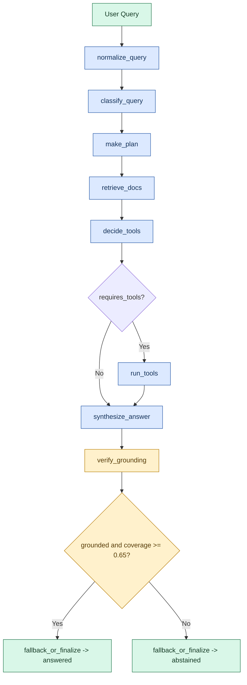
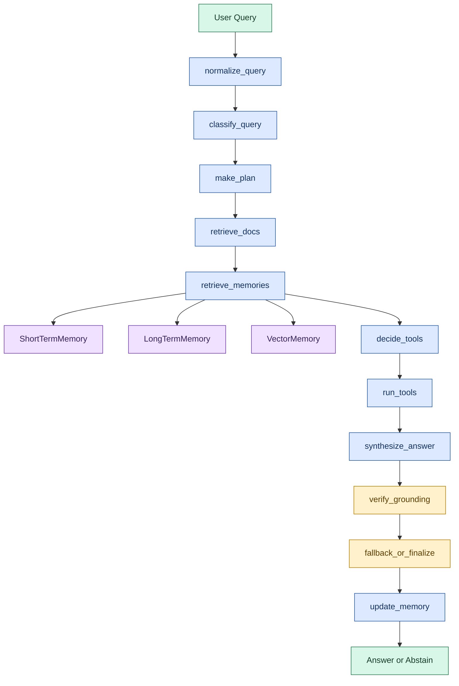
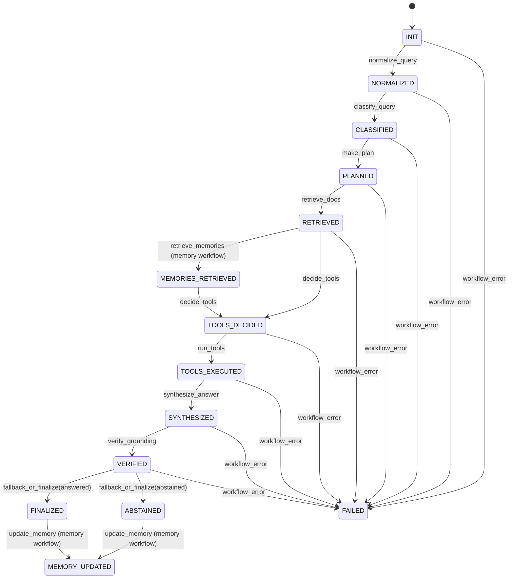

# Architecture Diagrams

This document captures the core execution paths of the repository so the notebooks, README, and interview walkthroughs all describe the same system.

## Workflow Flowchart

## Memory-Augmented Workflow

## State Lifecycle

